# Skill-Split Architecture Documentation

**Version**: 1.0.0
**Last Updated**: 2025-02-10
**Status**: Production Ready (518 tests passing)

---

## Table of Contents

1. [System Overview](#system-overview)
2. [Architecture Principles](#architecture-principles)
3. [System Architecture](#system-architecture)
4. [Data Flow](#data-flow)
5. [Database Schema](#database-schema)
6. [Search Architecture](#search-architecture)
7. [Component Handlers](#component-handlers)
8. [API Layer](#api-layer)
9. [Extension Points](#extension-points)
10. [Deployment Architecture](#deployment-architecture)

---

## System Overview

Skill-split is a Python-based intelligent document parsing and storage system that enables progressive disclosure of large documentation files. The system decomposes markdown, YAML, and various code files into discrete sections stored in a database, supporting both local SQLite and remote Supabase backends.

### Key Features

- **Multi-format Parsing**: Markdown headings, XML tags, JSON configs, shell scripts, Python/JavaScript/TypeScript
- **Dual Storage**: Local SQLite with FTS5 full-text search + Supabase cloud with vector embeddings
- **Progressive Disclosure**: Load sections individually to minimize token usage (99% context savings)
- **Hybrid Search**: BM25 keyword ranking + vector similarity search with configurable weights
- **Skill Composition**: Assemble new skills from existing sections with validation
- **Component Handlers**: Specialized parsers for plugins, hooks, configs, and scripts

### Technology Stack

```
Python 3.13+ | SQLite 3.38+ (FTS5) | Supabase (PostgreSQL + pgvector)
OpenAI Embeddings (text-embedding-3-small) | SHA256 Hashing
```

---

## Architecture Principles

### 1. Big-O Philosophy
- **3 AM Rule**: Code that makes sense at 3 AM when debugging
- **Single Responsibility**: Each module has one clear purpose
- **Junior Developer Principle**: Clear enough for anyone to understand

### 2. Design Patterns
- **Factory Pattern**: HandlerFactory for component-specific parsers
- **Strategy Pattern**: Different storage backends (SQLite vs Supabase)
- **Repository Pattern**: DatabaseStore abstracts data access
- **Builder Pattern**: SkillComposer constructs complex objects

### 3. Core Guarantees
- **Byte-Perfect Round-trip**: SHA256 verification ensures data integrity
- **Never Lose Data**: Defensive programming with validation at every step
- **Assume Errors**: Check before operations, fail gracefully

---

## System Architecture

### High-Level Architecture

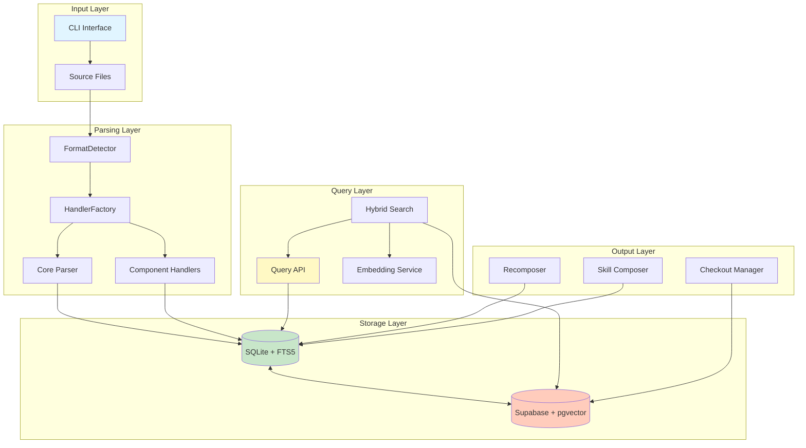

### Component Overview

| Layer | Component | Responsibility |
|-------|-----------|----------------|
| **Input** | CLI (`skill_split.py`) | Command-line interface with 16 commands |
| **Parsing** | `Parser` | Markdown headings, XML tag extraction |
| **Parsing** | `FormatDetector` | File type and format detection |
| **Parsing** | `HandlerFactory` | Route to appropriate component handler |
| **Parsing** | Component Handlers | Specialized parsers (plugins, hooks, scripts) |
| **Storage** | `DatabaseStore` | SQLite operations with FTS5 |
| **Storage** | `SupabaseStore` | Remote storage with vector search |
| **Query** | `QueryAPI` | Progressive disclosure operations |
| **Query** | `HybridSearch` | BM25 + vector combination |
| **Output** | `Recomposer` | Byte-perfect file reconstruction |
| **Output** | `SkillComposer` | Assemble skills from sections |
| **Output** | `CheckoutManager` | File deployment and tracking |

---

## Data Flow

### Parse and Store Flow

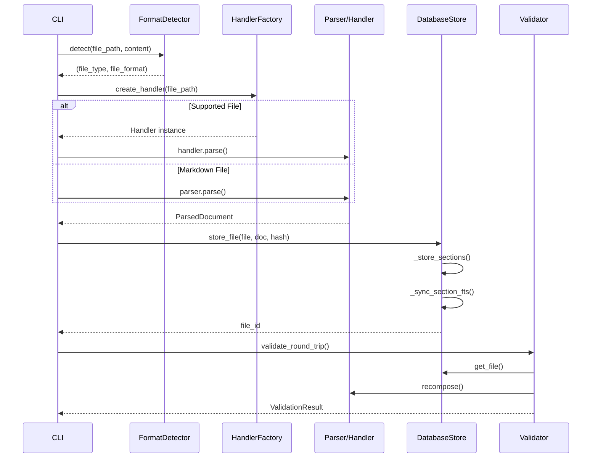

### Search and Retrieve Flow

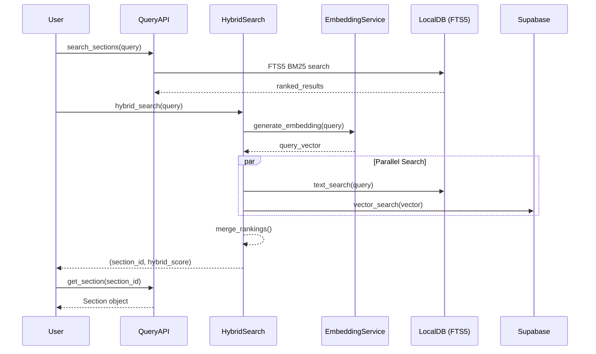

### Progressive Disclosure Flow

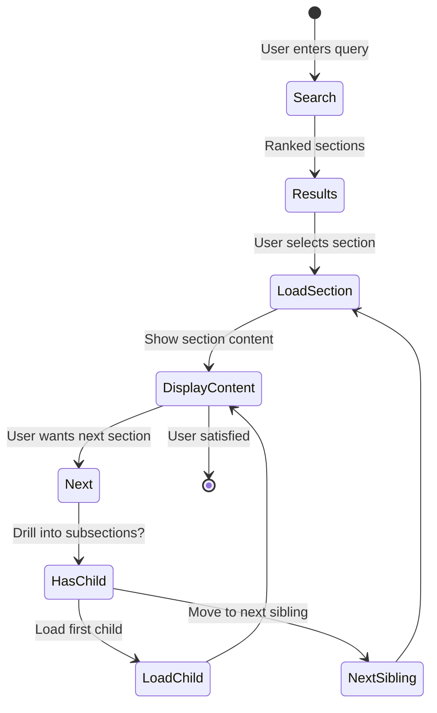

---

## Database Schema

### SQLite Schema (Local)

```mermaid
erDiagram
    FILES ||--o{ SECTIONS : contains
    FILES ||--o{ CHECKOUTS : tracks
    SECTIONS ||--o{ SECTIONS : parent_child
    SECTIONS ||--o|| SECTIONS_FTS : fulltext_index

    FILES {
        INTEGER id PK
        TEXT path UK
        TEXT type
        TEXT frontmatter
        TEXT hash
        TIMESTAMP created_at
        TIMESTAMP updated_at
    }

    SECTIONS {
        INTEGER id PK
        INTEGER file_id FK
        INTEGER parent_id FK
        INTEGER level
        TEXT title
        TEXT content
        INTEGER order_index
        INTEGER line_start
        INTEGER line_end
        TEXT closing_tag_prefix
    }

    SECTIONS_FTS {
        INTEGER rowid PK
        TEXT title
        TEXT content
    }

    CHECKOUTS {
        INTEGER id PK
        TEXT file_id FK
        TEXT user_name
        TEXT target_path
        TEXT status
        TIMESTAMP checked_out_at
        TIMESTAMP checked_in_at
    }
```

### Supabase Schema (Cloud)

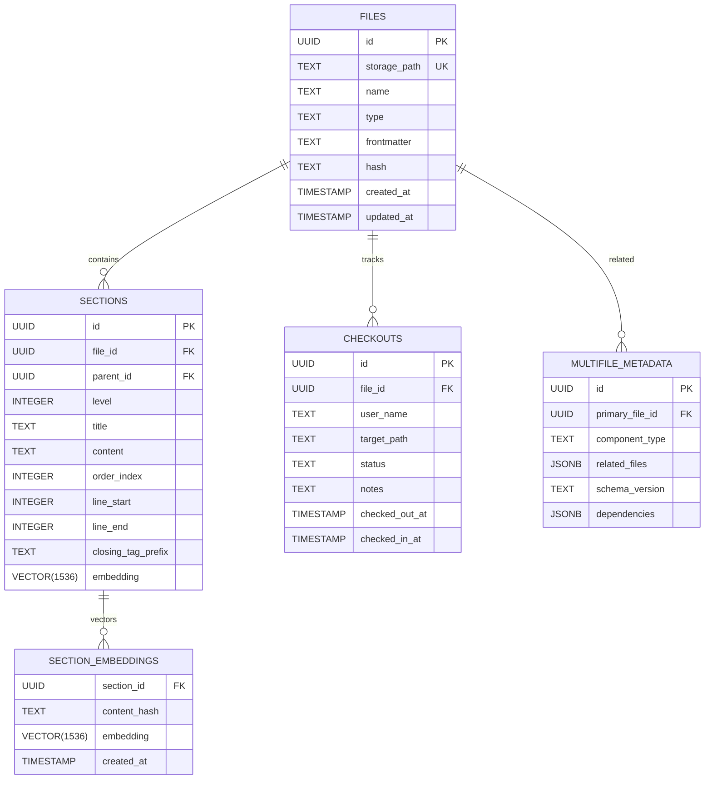

### Key Relationships

- **CASCADE Delete**: Deleting a file automatically removes all sections
- **Foreign Keys**: `sections.file_id` → `files.id`, `sections.parent_id` → `sections.id`
- **FTS5 External Content**: `sections_fts` mirrors `sections` for full-text search
- **Vector Index**: Supabase uses ivfflat HNSW indexing for fast similarity search

---

## Search Architecture

### Three-Tier Search System

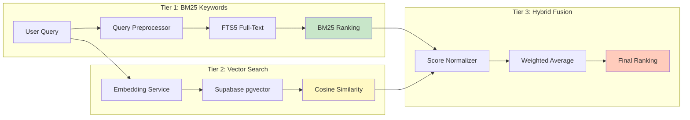

### Search Modes Comparison

| Mode | Use Case | Speed | Accuracy | API Key Required |
|------|----------|-------|----------|------------------|
| **BM25** (Keywords) | Exact term matching, technical queries | Fastest | High for precise terms | No |
| **Vector** (Semantic) | Conceptual similarity, synonyms | Fast | High for meaning | Yes (OpenAI) |
| **Hybrid** (Combined) | Best overall results | Medium | Highest | Yes (OpenAI) |

### Query Preprocessing

```
Natural Language Input
         |
         v
[Contains Operators?] ──Yes──> Normalize AND/OR/NEAR to uppercase
         |
         No
         |
[Quoted Phrase?] ──Yes──> Use as-is (phrase search)
         |
         No
         |
[Single Word?] ──Yes──> Quote if special chars
         |
         No
         |
[Multi-word] ──Yes──> Convert to OR for discovery
         |
         v
    FTS5 MATCH Syntax
```

**Example Transformations**:
- `"python handler"` → `"python handler"` (phrase search)
- `python AND handler` → `python AND handler` (user operator)
- `python handler` → `"python" OR "handler"` (discovery mode)

### Hybrid Scoring Formula

```
hybrid_score = (vector_weight × vector_similarity) + ((1 - vector_weight) × text_score)

Where:
- vector_weight: 0.0 (text-only) to 1.0 (vector-only), default 0.7
- vector_similarity: Cosine similarity from pgvector (0-1)
- text_score: Normalized BM25 rank (0-1)
```

### Performance Metrics

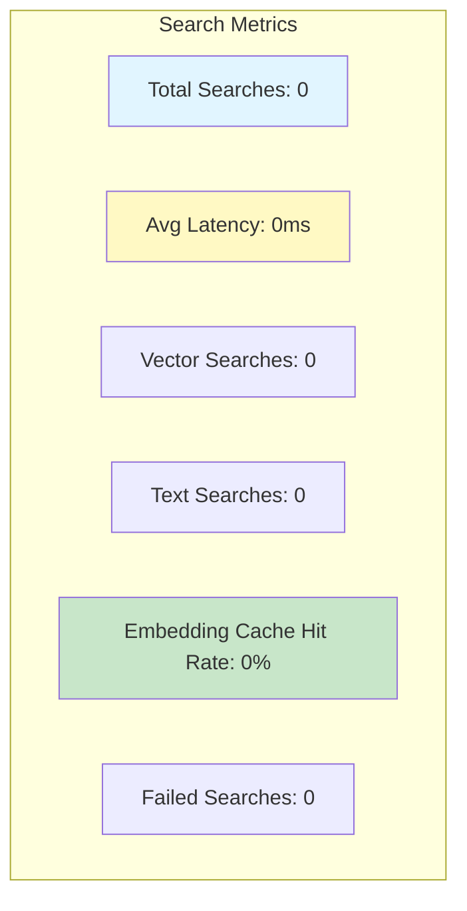

---

## Component Handlers

### Handler Architecture

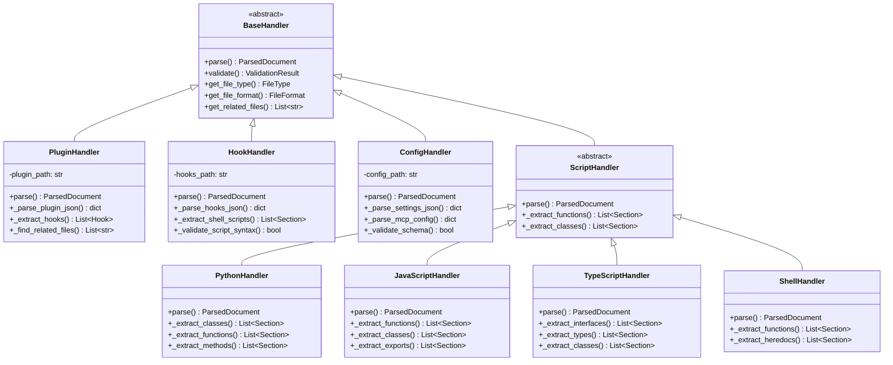

### Supported File Types

| Handler | Extensions | Parsed Elements | Multi-File |
|---------|------------|-----------------|------------|
| **PluginHandler** | `.json` (plugin.json) | Commands, hooks, metadata | Yes (.mcp.json, hooks.json) |
| **HookHandler** | `.json` (hooks.json) | Hook definitions | Yes (shell scripts) |
| **ConfigHandler** | `.json` (settings.json, mcp_config.json) | Settings, MCP servers | No |
| **PythonHandler** | `.py` | Classes, functions, methods | No |
| **JavaScriptHandler** | `.js`, `.jsx` | Functions, classes, exports | No |
| **TypeScriptHandler** | `.ts`, `.tsx` | Interfaces, types, classes | No |
| **ShellHandler** | `.sh` | Functions, heredocs | No |

### Handler Factory Flow

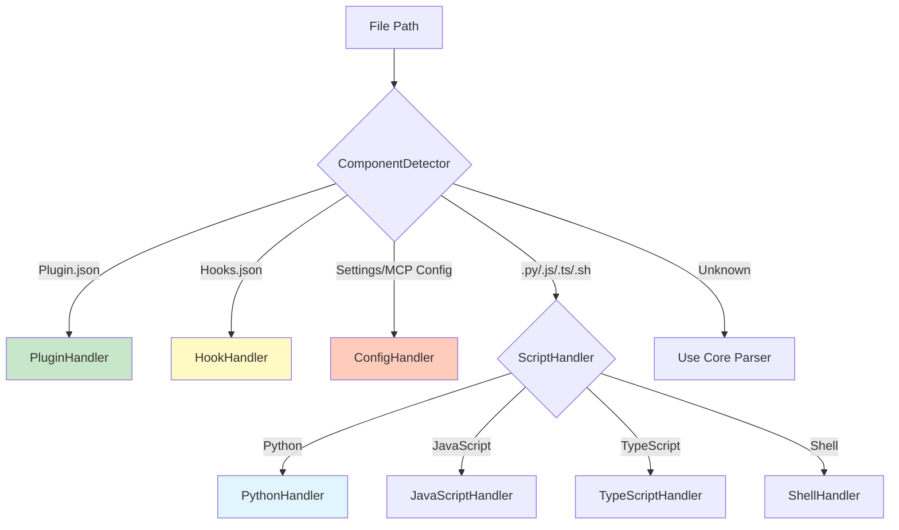

---

## API Layer

### CLI Commands (16 Total)

#### Core Commands

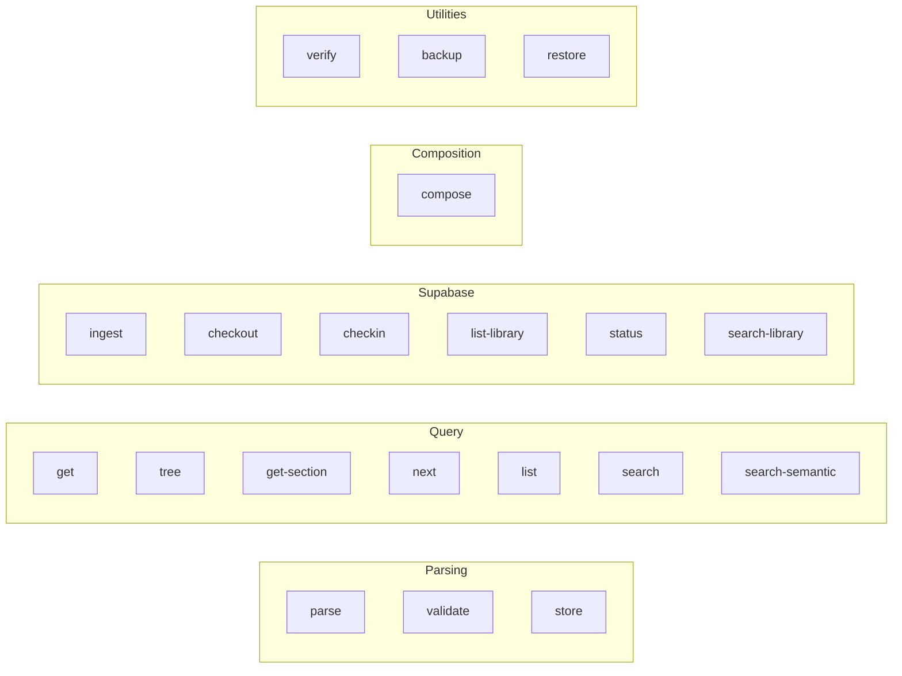

#### Command Reference

| Command | Purpose | Database |
|---------|---------|----------|
| `parse <file>` | Display structure without storing | N/A |
| `validate <file>` | Validate file structure | N/A |
| `store <file> --db <path>` | Parse and store | Local |
| `get <file> --db <path>` | Retrieve file metadata | Local |
| `tree <file> --db <path>` | Show section hierarchy | Local |
| `get-section <id> --db <path>` | Load single section | Local |
| `next <id> <file> --db <path>` | Get next section | Local |
| `list <file> --db <path>` | List sections with IDs | Local |
| `search <query> --db <path>` | BM25 keyword search | Local |
| `search-semantic <query> --db <path>` | Hybrid vector search | Local + Supabase |
| `verify <file> --db <path>` | Round-trip validation | Local |
| `ingest <dir>` | Batch upload | Supabase |
| `checkout <id> <path>` | Deploy file | Supabase |
| `checkin <path>` | Return file | Supabase |
| `list-library` | List all files | Supabase |
| `status [--user]` | Show checkouts | Supabase |
| `search-library <query>` | Search files | Supabase |
| `compose --sections <ids> --output <file>` | Create new skill | Local |
| `backup [--db <path>]` | Create backup | Local |
| `restore <backup> [--db <path>]` | Restore from backup | Local |

### Query API

```python
from core.query import QueryAPI

query_api = QueryAPI(db_path)

# Progressive disclosure operations
section = query_api.get_section(section_id)
next_section = query_api.get_next_section(current_id, file_path, first_child=True)
tree = query_api.get_section_tree(file_path)

# Search operations
results = query_api.search_sections(query)  # FTS5 BM25
ranked = query_api.search_sections_with_rank(query)  # With scores
```

### Hybrid Search API

```python
from core.hybrid_search import HybridSearch
from core.embedding_service import EmbeddingService

embedding_service = EmbeddingService(openai_api_key)
hybrid = HybridSearch(embedding_service, supabase_store, query_api)

# Adjustable vector weight (0.0 = text-only, 1.0 = vector-only)
results = hybrid.hybrid_search(
    query="how to setup git",
    limit=10,
    vector_weight=0.7
)

# Get performance metrics
metrics = hybrid.get_metrics()
```

---

## Extension Points

### Adding a New Handler

1. **Create Handler Class**:

```python
from handlers.base import BaseHandler
from models import FileType, FileFormat, ParsedDocument

class MyHandler(BaseHandler):
    def __init__(self, file_path: str):
        self.file_path = file_path

    def parse(self) -> ParsedDocument:
        # Implementation
        pass

    def validate(self) -> ValidationResult:
        # Implementation
        pass

    def get_file_type(self) -> FileType:
        return FileType.MY_TYPE

    def get_file_format(self) -> FileFormat:
        return FileFormat.CUSTOM
```

2. **Register in ComponentDetector**:

```python
# In handlers/component_detector.py
def detect(self, file_path: str) -> tuple[FileType, FileFormat]:
    # Add detection logic
    if file_path.endswith('.myext'):
        return FileType.MY_TYPE, FileFormat.CUSTOM
```

3. **Register in HandlerFactory**:

```python
# In handlers/factory.py
@classmethod
def list_supported_extensions(cls) -> list[str]:
    return [..., '.myext']
```

### Adding a New Search Backend

```python
from core.database import DatabaseStore

class CustomSearchStore(DatabaseStore):
    def search_sections_with_rank(
        self, query: str, file_path: Optional[str] = None
    ) -> List[Tuple[int, float]]:
        # Implement custom search logic
        results = self._custom_search_algorithm(query)
        return results
```

### Adding a New Validation Rule

```python
from core.skill_validator import validate_skill, ValidationResult

def custom_validation_rule(doc: ParsedDocument) -> tuple[bool, List[str], List[str]]:
    errors = []
    warnings = []

    # Custom validation logic
    if some_condition:
        errors.append("Custom validation failed")

    return len(errors) == 0, errors, warnings
```

---

## Deployment Architecture

### Database Locations

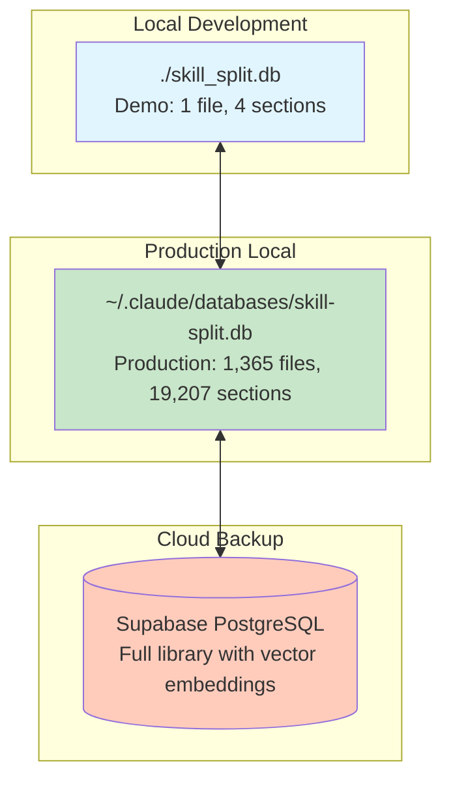

### Schema Migration

If upgrading from an old schema, run:

```sql
ALTER TABLE sections ADD COLUMN closing_tag_prefix TEXT DEFAULT '';
```

### Backup and Restore

```bash
# Create backup
./skill_split.py backup --filename my-backup.sql.gz

# Restore from backup
./skill_split.py restore my-backup.sql.gz --db ~/.claude/databases/skill-split.db --overwrite
```

### Environment Variables

```bash
# Database
SKILL_SPLIT_DB=~/.claude/databases/skill-split.db

# Supabase
SUPABASE_URL=https://your-project.supabase.co
SUPABASE_KEY=your-anon-key

# OpenAI (for embeddings)
OPENAI_API_KEY=sk-...
ENABLE_EMBEDDINGS=true
```

---

## Performance Characteristics

### Token Efficiency

```
Original File: 21,000 tokens
Section Average: 204 tokens
Context Savings: 99.03%

Progressive Loading:
- First section: 204 tokens
- Next sections: 204 tokens each
- Total loaded: Only what's needed
```

### Search Performance

| Operation | Local (SQLite) | Cloud (Supabase) |
|-----------|----------------|------------------|
| BM25 Search | ~10ms | ~50ms |
| Vector Search | N/A | ~100ms |
| Hybrid Search | ~110ms | ~150ms |
| Section Retrieval | ~1ms | ~20ms |

### Scalability

- **Files per Database**: Tested up to 1,365 files
- **Sections per File**: Tested up to 92 sections
- **Total Sections**: 19,207 sections in production
- **Search Index**: FTS5 handles full corpus efficiently
- **Vector Index**: Supabase ivfflat HNSW for similarity search

---

## Security Considerations

### Secrets Management

```python
from core.secret_manager import SecretManager

# Secrets stored in ~/.claude/secrets.json
secret_manager = SecretManager()
supabase_key = secret_manager.get_secret("SUPABASE_KEY")
```

### SQL Injection Prevention

- All queries use parameterized statements
- User input is validated before database operations
- FTS5 queries are preprocessed to prevent injection

### File Access Control

- Checkout/checkin system tracks file deployments
- User attribution for all operations
- Safe rollback on failed operations

---

## Testing Strategy

### Test Coverage

- **518 Total Tests** (as of Phase 02 completion)
- **Unit Tests**: Individual component testing
- **Integration Tests**: Cross-component workflows
- **Round-trip Tests**: Byte-perfect verification
- **Real-world Tests**: Production database validation

### Test Categories

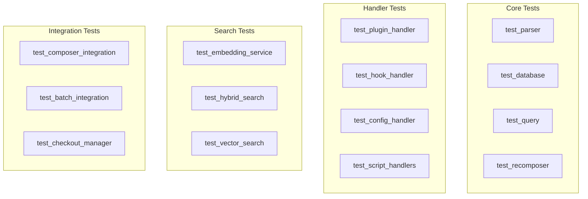

---

## Architecture Decision Records

### ADR-001: SQLite FTS5 for Local Search

**Status**: Accepted

**Context**: Need fast, reliable keyword search without external dependencies.

**Decision**: Use SQLite FTS5 with BM25 ranking for local search.

**Consequences**:
- (+) Fast full-text search (~10ms)
- (+) No external services required
- (+) Portable database files
- (-) Limited to keyword matching (no semantic understanding)

### ADR-002: Supabase + pgvector for Cloud Storage

**Status**: Accepted

**Context**: Need cloud backup with semantic search capabilities.

**Decision**: Use Supabase PostgreSQL with pgvector extension.

**Consequences**:
- (+) Vector similarity search for semantic understanding
- (+) Automatic backups and replication
- (+) Real-time synchronization
- (-) Requires network connectivity
- (-) OpenAI API costs for embeddings

### ADR-003: Hybrid Search with Configurable Weights

**Status**: Accepted

**Context**: Users need both precision (keywords) and discovery (semantic).

**Decision**: Implement hybrid scoring with adjustable vector_weight parameter.

**Consequences**:
- (+) Flexible search behavior
- (+) Best of both approaches
- (-) More complex implementation
- (-) Requires API keys for vector search

### ADR-004: SHA256 Hashing for Integrity Verification

**Status**: Accepted

**Context**: Must guarantee byte-perfect round-trip accuracy.

**Decision**: SHA256 hashing of all files with verification on recomposition.

**Consequences**:
- (+) Detects any data corruption
- (+) Confirms parse/recompose accuracy
- (-) Additional compute overhead

### ADR-005: Factory Pattern for Component Handlers

**Status**: Accepted

**Context**: Need extensible parser architecture for different file types.

**Decision**: Factory pattern with HandlerFactory and BaseHandler abstraction.

**Consequences**:
- (+) Easy to add new file types
- (+) Clean separation of concerns
- (+) Consistent interface
- (-) More boilerplate for new handlers

---

## Future Enhancements

### Planned Features

1. **GraphQL API**: Alternative to REST for complex queries
2. **Web Interface**: Browser-based exploration and composition
3. **Real-time Sync**: WebSocket-based updates
4. **ML-Based Ranking**: Learn from user interactions
5. **Multi-language Support**: Beyond English embeddings

### Under Consideration

- Distributed storage (IPFS)
- Collaborative editing
- Version control integration
- Advanced analytics dashboard

---

## References

- **[README.md](../README.md)**: Complete documentation
- **[CLI_REFERENCE.md](./CLI_REFERENCE.md)**: Command reference
- **[EXAMPLES.md](../EXAMPLES.md)**: Usage examples
- **[DEPLOYMENT_STATUS.md](../DEPLOYMENT_STATUS.md)**: Deployment guide

---

*This document is maintained as part of the skill-split project. For questions or contributions, refer to the main project documentation.*
